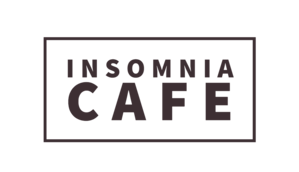

# Insomnia Cafe :coffee:
## Projeto desenvolvido por **Leonardo Alves** como atividade para o nanodegree Full-Stack da **Gama Academy**.

Para completar a tarefa, foi necessário criar um site de catálogo de produtos contemplando as seguintes características:
* Uma vitrine virtual de produtos (no melhor estilo Mercado Livre, por exemplo);
* Uma página com detalhes de um determinado produto;
* Uma página institucional;
* Criação do repositório no Github;
* As páginas devem ser navegáveis (link entre elas, todos os links das página devem estar levando para a página adequada);
* CSS implementado de acordo com os guidelines do treinamento;
* As páginas devem ser responsivas e oferecer boa experiência em diferentes tamanhos de dispositivos.

Tendo como inspiração a cafeteria do *sitcom* **FRIENDS**, foi decidido que a vitrine virtual seria de uma cafeteria chamada **Insomnia Cafe**, que era o nome original dessa série.:coffee:

A proposta foi deixar o site o mais *clean* possível, utilizando tons terrosos na paleta de cores, remetendo ao próprio café.

:sparkles:[Confira o resultado final do site clicando aqui.](https://leomonadas.github.io/insomnia-cafe-case/):sparkles:
